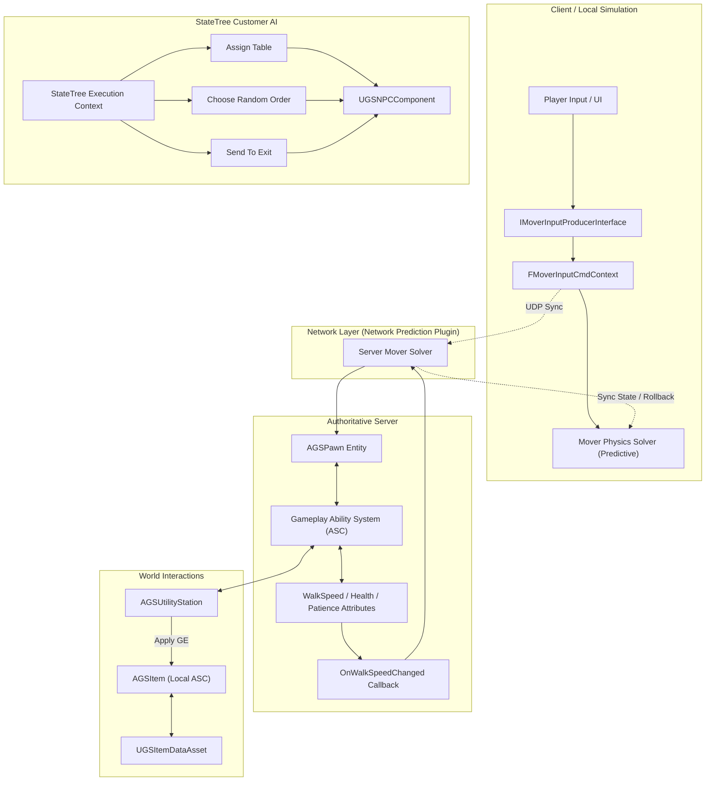

# ProjectF: Good Service (Unreal Engine 5.8)

[](https://www.unrealengine.com/)
[](https://isocpp.org/)
[](https://dev.epicgames.com/)
[](https://docs.unrealengine.com/)
[](https://docs.unrealengine.com/)
[](https://docs.unrealengine.com/)
[](https://dev.epicgames.com/)

## Project Overview

**ProjectF (Good Service)** is a multiplayer service and restaurant simulation framework built in **Unreal Engine 5.8**. The project serves as an architectural blueprint for modern multiplayer game design, replacing legacy engine patterns with modular, data-driven frameworks.

### Core Architectural Pillars

* **Mover Framework (`UCharacterMoverComponent`):** Replaces legacy monolithic movement components with modular, constraint-based physical movement. Integrates with the **Network Prediction** plugin for authoritative server replication and client-side prediction with rollback and replay.
* **Gameplay Ability System (GAS):** Attribute sets, abilities, and effects are bound bidirectionally to movement, items, and world stations.
* **Data-Driven Entity Architecture:** Dynamic items (`AGSItem`) carry localized Ability System Components and attribute sets driven by `UGSItemDataAsset`.
* **StateTree AI:** Hierarchical decision trees for AI customer NPCs, driving table reservation, menu ordering, patience timing, and exit routing.
* **Unreal Engine 6.0 / Verse Readiness:** Designed with future migration paths to Verse asynchronous concurrency, transactional memory (STM), and reactive input streams in mind.

---

## Documentation Portal

The complete documentation suite is divided into two distinct sections below. Click on either section header to expand the embedded interactive summary, or click the direct links to read the full markdown manuals.

<details>
<summary><b>Section 1: Project & Gameplay Architecture Documentation (Mover, GAS & StateTree AI)</b></summary>

<br>

### Overview of Architectural Findings

* **Mover vs. Legacy CharacterMovement:** Detailed analysis of constraint-based physical simulation versus legacy monolithic `ACharacter` physics.
* **Kinematic Net Input Context (`FMoverInputCmdContext`):** How client inputs and AI navigation directives are packaged into prediction buffers for network rollback and replay.
* **Mover vs. Chaos Physics Coexistence:** Addressing asynchronous Physics Substepping challenges by implementing kinematic parabolic launches (`LaunchKinematic`) to avoid desynchronization jitter.
* **Bidirectional Mover + GAS Synergy:** Real-time attribute delegate listeners dynamically updating physical Mover speed settings upon Gameplay Effect application.
* **StateTree AI Customer Lifecycle:** Flat decision tree tasks governing NPC table assignment, recipe selection, patience decay, and payment processing.
* **UE 6.0 Verse Evolution Notes:** Migration guidelines exploring how C++ delegates and StateTree tasks translate into native Verse asynchronous coroutines (`race`, `sync`, `suspending`).

**[Read Full Project Documentation](docs/PROJECT_DOCUMENTATION.md)**

</details>

<details>
<summary><b>Section 2: Technical & Developer Implementation Manual (C++ Reference & Extension Guide)</b></summary>

<br>

### Developer Guide & Code Implementations

* **Data-Driven Item Creation (`AGSItem` & `UGSItemDataAsset`):** Creating self-contained GAS items with localized attribute sets, polymorphic state actions (static mesh overrides, spatial audio, particle emitters), and tag delegates.
* **Interactive Utility Stations (`AGSUtilityStation`):** Building world processing stations (ovens, freezers, sinks) that apply base or conditional Gameplay Effects to items based on active tag states.
* **Abilities, Emotes & Kinematic Stacking:**
  * Networked 3D spatialized emote playback (`GSAbility_PlayEmote`).
  * Recursive vertical item stacking height calculations in `GSAbility_Grab`.
  * Kinematic parabolic flight trajectory calculations in `GSAbility_Launch`.
* **NPC Order Validation & Payment:** Server-side logic for checking food tags, cooked/burned tag states, item destruction, and physical currency spawning (`AGSMoneyItem`).

**[Read Full Technical Documentation](docs/TECHNICAL_DOCUMENTATION.md)**

</details>

---

## System Architecture Diagram



---

## Project Structure

```
.
├── Config/                        # Engine and Game configuration INI files
├── Content/                       # Unreal Engine Assets, Blueprints, Meshes, Audio
├── Source/
│   └── ProjectF/
│       ├── Private/               # C++ System Implementations
│       │   ├── Abilities/         # GAS Grab, Launch, Emote abilities
│       │   ├── Attributes/        # Attribute Sets (Cooking, Health, Speed, Patience)
│       │   ├── Characters/        # AGSPawn, PlayerController, PlayerState
│       │   ├── Components/        # Grabbable, Money, NPC Components
│       │   ├── Core/              # GameInstance, GameMode, GameState, NPCManager
│       │   ├── DataAssets/        # Item, Menu, Station Data Assets
│       │   ├── IA/tasks/          # StateTree AI C++ Tasks
│       │   ├── Items/             # AGSItem, AGSMoneyItem
│       │   └── Machines/          # AGSUtilityStation, AbilityUpgradeStation
│       └── Public/                # C++ System Headers
├── docs/
│   ├── PROJECT_DOCUMENTATION.md   # Comprehensive Mover, GAS & StateTree Architecture Guide
│   └── TECHNICAL_DOCUMENTATION.md # Developer Implementation & Extension Manual
└── ProjectF.uproject              # Unreal Engine 5.8 Project File
```

---

## System Requirements & Compilation

### Environment Requirements
* **Unreal Engine:** 5.8
* **Compiler:** Microsoft Visual Studio 2022 (v143 toolset with C++ Game Development workload)
* **Target OS:** Windows 10/11 (64-bit)
* **Key Engine Plugins Enabled:**
  * Mover (`Mover`, `ChaosMover`, `MoverIntegrations`)
  * Gameplay Abilities (`GameplayAbilities`)
  * StateTree (`StateTree`, `GameplayStateTree`)
  * Network Prediction (`NetworkPrediction`)
  * Steam Sockets (`OnlineSubsystemSteam`, `SteamSockets`)

### Building the Project
1. Clone the repository:
   ```bash
   git clone https://github.com/TheLastBonny/Good-Service-PlaceHolder-.git
   ```
2. Right-click `ProjectF.uproject` and select **Generate Visual Studio project files**.
3. Open `ProjectF.sln` in Visual Studio 2022.
4. Set build configuration to **Development Editor** and platform to **Win64**.
5. Compile solution (`Ctrl + Shift + B`) and launch the editor.

---

## Document Links

* [Project & Gameplay Architecture Documentation](docs/PROJECT_DOCUMENTATION.md)
* [Technical & Developer Implementation Manual](docs/TECHNICAL_DOCUMENTATION.md)